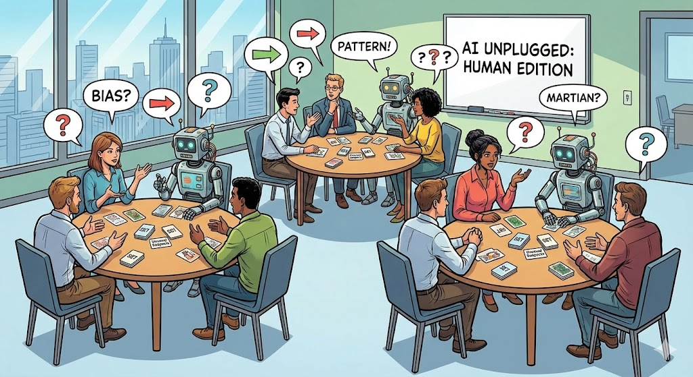
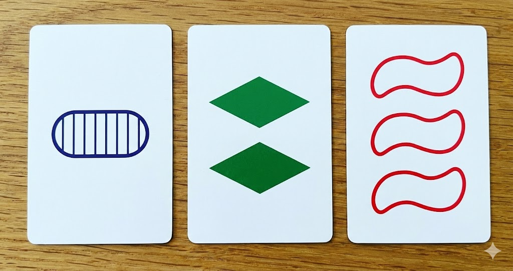

We often talk about Artificial Intelligence as an abstract, cloud-based entity that magically solves problems. But for many stakeholders, what happens inside that "black box" remains a mystery.

Recently, I attended an Open Space event that shifted my perspective on tech education. I participated in a session that demystified machine learning using nothing but board games. It was so effective that I thought: *'I need to bring this to my team.'*

So, I adapted the experiment for a workshop with 30 professionals. The premise was simple: **We are going to train a neural network. But we are going to do it without computers.**

Welcome to **"AI Unplugged"**. Just us, a few decks of cards, and the friction of human bias.

## The Setup: Humans as Machines

The goal was to strip away the Python code and focus on the concepts. I split the room into groups of five:

* **4 Trainers:** They hold the "Ground Truth" (a secret rule).
* **1 Model (The AI):** Their job is to predict the rule based on training data.

The "AI" would leave the room. The Trainers would select a secret rule (e.g., "Cards with red items are YES"). When the AI returned, they were shown 15 labeled examples. Then, the AI had to predict the classification of 5 new cards.

What followed was a perfect demonstration of the two realities of Data Science.

## Part 1: The Comfort of Structured Data

We started with cards from the game **SET**. For those unfamiliar, these cards are geometrically perfect: clear shapes, distinct colors, specific shading.

- **The Outcome:** The human "AIs" figured out the classification criteria almost instantly.
- **The Tech Concept:** This is **Structured Data**.

It felt like a clean Excel spreadsheet. With limited variables (features) and clear categories, the patterns were obvious. The model learned quickly, and the predictions were 100% accurate. The room felt confident. "AI is easy", they thought.

Then, we changed the dataset.

## Part 2: The Chaos of Unstructured Data

For the second round, we switched to **Unusual Suspects**, a game featuring illustrations of people with infinite details: clothing, expressions, accessories, perceived age.

- **The Outcome:** The confidence evaporated. The "AIs" struggled, hesitated, and argued.
- **The Tech Concept:** This is the **Curse of Dimensionality**.

Unlike a red triangle, a human face has infinite features. 15 training cards weren't enough to capture the complexity. When the "AIs" tried to guess the rule, they failed significantly more often. This transition, from the clarity of geometry to the messiness of humanity, visibly frustrated the participants.

## Three Lessons from the "Black Box"

After the chaos, we regrouped. The post-game analysis revealed three critical flaws in how we perceive AI:

### 1. The Illusion of Understanding (Explainability)

I asked the groups: *"Did the AI classify the final cards correctly?"*
Most said **YES**, even for the unstructured data.
Then I asked: *"Did the AI guess the exact rule you used?"*
Many said **NO**.

This is the core paradox of Deep Learning. The model developed a "gut feeling" (mathematical intuition or pattern matching) that produced the right answer, but for the wrong reasons. **Accuracy does not equal understanding.**

### 2. The "Martian" Problem (Out of Distribution)

We discussed a hypothetical: What if we slipped a card of a Martian into the deck of humans? Or a yellow circle into the SET deck?

The AI would still say "Yes" or "No." It would not say *"I don't know what this is"*.
Models are confident by design. When fed **Out of Distribution (OOD)** data, they don't realize the context has changed; they simply hallucinate an answer based on old patterns.

### 3. Scaling Bias

In the second round, criteria became subjective (e.g., "looks friendly").
If the Trainers have a bias, the AI doesn't just learn it: it **codifies and scales it**. The participants realized that the "Ground Truth" isn't objective truth; it's just the opinion of whoever labeled the data.

## The Facilitator’s View: Managing the Analog Cloud

Running a non-digital workshop for a digital audience was a challenge in itself. Here are a few takeaways on leading this dynamic:

* **Embrace the Analog Focus:** There was initial skepticism about "playing cards", but the tactile nature of the game forced people to look at each other, not screens. The engagement was higher than any PowerPoint session I’ve run.
* **Logistics are Key:** Pre-sorting decks into "training kits" saved massive amounts of time. In a live workshop, momentum is everything.
* **Facilitation vs. Teaching:** My role wasn't to lecture, but to guide the debate. However, for groups larger than 20, **I recommend a co-facilitator.** The debates in the "Unstructured" round get heated, and having support to manage the energy is crucial.

## Final Thoughts

You don't need GPUs to understand the risks of AI. By becoming the algorithm, we felt the frustration of unclear data and the dangerous confidence of false positives.

We walked away with a clear mandate: **We cannot blindly trust the output just because the math works.** It is our job to ask the questions the machine cannot.